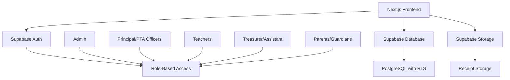
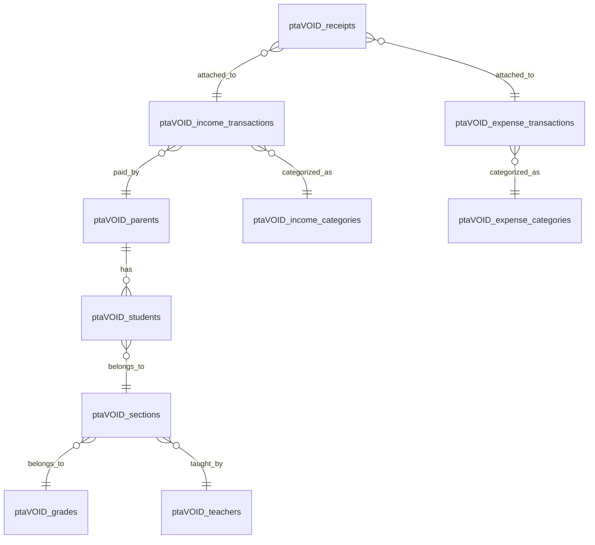
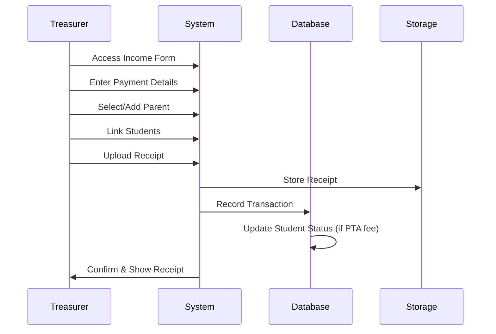
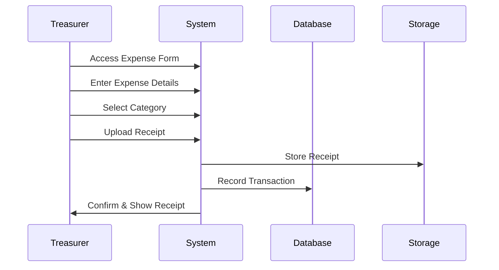

# Vel PTA Management Web App - Implementation Plan

## 🎯 Project Overview

**Tech Stack:**
- Frontend: Next.js 14 + TypeScript + Tailwind CSS
- Backend: Supabase (PostgreSQL + Auth + Storage)
- Database: PostgreSQL with `ptaVOID_` prefix
- ORM: Prisma
- Deployment: Vercel (Frontend) + Supabase (Backend)

## 🏗️ Architecture Design



## 📊 Database Schema Design

### Core Tables (with ptaVOID_ prefix)

1. **ptaVOID_users** - Authentication & roles
2. **ptaVOID_parents** - Parent/Guardian information
3. **ptaVOID_students** - Student records
4. **ptaVOID_teachers** - Teacher information
5. **ptaVOID_grades** - Grade/Year levels
6. **ptaVOID_sections** - Class sections
7. **ptaVOID_income_categories** - Income types
8. **ptaVOID_expense_categories** - Expense types
9. **ptaVOID_income_transactions** - Income records
10. **ptaVOID_expense_transactions** - Expense records
11. **ptaVOID_receipts** - Receipt attachments
12. **ptaVOID_audit_logs** - Transaction audit trail

### Key Relationships



## 🔐 Security & Access Control

### Role-Based Permissions

| Role | Permissions |
|------|-------------|
| **Admin** | Full system access, user management |
| **Principal** | View all reports, dashboard access |
| **PTA Officers** | View reports, manage categories |
| **Treasurer** | Record payments/expenses, upload receipts |
| **Teachers** | View class payment status |
| **Parents** | View own payment history |

### Row Level Security (RLS) Policies

- Users can only access data relevant to their role
- Teachers see only their assigned sections
- Parents see only their own records
- Audit logs for all transactions

## 🎨 UI/UX Design Structure

### Page Structure

```
/
├── auth/
│   ├── login
│   └── register
├── dashboard/
│   ├── admin/
│   ├── principal/
│   ├── teacher/
│   ├── treasurer/
│   └── parent/
├── income/
│   ├── record
│   ├── categories
│   └── reports
├── expenses/
│   ├── record
│   ├── categories
│   └── reports
├── students/
│   ├── manage
│   └── payments
├── reports/
│   ├── financial
│   ├── class-status
│   └── audit
└── settings/
    ├── users
    ├── categories
    └── system
```

## 🔄 Core Workflows

### 1. Income Recording Workflow



### 2. Expense Recording Workflow



## 📱 Component Architecture

### Shared Components
- `Layout` - Main app layout with navigation
- `Dashboard` - Role-based dashboard wrapper
- `DataTable` - Reusable table with sorting/filtering
- `FormModal` - Modal for CRUD operations
- `FileUpload` - Receipt upload component
- `ReportChart` - Chart components for reports
- `StatusBadge` - Payment status indicators

### Feature Components
- `IncomeForm` - Payment recording form
- `ExpenseForm` - Expense recording form
- `StudentList` - Student management
- `PaymentStatus` - Class payment overview
- `FinancialReport` - Financial reporting
- `AuditLog` - Transaction history

## 🚀 Implementation Phases

### Phase 1: Foundation (Week 1)
- [ ] Project setup with Next.js + TypeScript
- [ ] Supabase configuration
- [ ] Database schema creation
- [ ] Authentication setup
- [ ] Basic layout and navigation

### Phase 2: Core Features (Week 2-3)
- [ ] User management and roles
- [ ] Parent/Student CRUD
- [ ] Income recording system
- [ ] Expense recording system
- [ ] Receipt upload functionality

### Phase 3: Reporting & Dashboard (Week 4)
- [ ] Role-based dashboards
- [ ] Financial reports
- [ ] Class payment status
- [ ] KPI indicators
- [ ] Export functionality

### Phase 4: Advanced Features (Week 5)
- [ ] Audit trails
- [ ] Advanced filtering
- [ ] Bulk operations
- [ ] Email notifications
- [ ] Mobile responsiveness

### Phase 5: Testing & Deployment (Week 6)
- [ ] Unit testing
- [ ] Integration testing
- [ ] Performance optimization
- [ ] Production deployment
- [ ] User training materials

## 🛠️ Development Standards

### Code Organization
```
src/
├── components/
│   ├── ui/           # Reusable UI components
│   ├── forms/        # Form components
│   ├── tables/       # Table components
│   └── charts/       # Chart components
├── pages/
│   ├── api/          # API routes
│   ├── auth/         # Authentication pages
│   └── dashboard/    # Dashboard pages
├── lib/
│   ├── supabase.ts   # Supabase client
│   ├── auth.ts       # Auth utilities
│   ├── database.ts   # Database utilities
│   └── utils.ts      # General utilities
├── types/            # TypeScript definitions
├── hooks/            # Custom React hooks
└── styles/           # Global styles
```

### Naming Conventions
- Components: PascalCase (`IncomeForm`)
- Files: kebab-case (`income-form.tsx`)
- Database: snake_case with prefix (`ptaVOID_income_transactions`)
- API routes: kebab-case (`/api/income-transactions`)

## 📊 Performance Considerations

- **Database Indexing**: Proper indexes on frequently queried columns
- **Caching**: Redis for session and query caching
- **Pagination**: Server-side pagination for large datasets
- **Image Optimization**: Next.js Image component for receipts
- **Bundle Optimization**: Code splitting and lazy loading

## 🔍 Monitoring & Analytics

- **Error Tracking**: Sentry integration
- **Performance Monitoring**: Vercel Analytics
- **Database Monitoring**: Supabase built-in monitoring
- **User Analytics**: Privacy-focused analytics
- **Audit Logging**: Comprehensive transaction logs

## 🚦 Success Metrics

### Technical KPIs
- Page load time < 2 seconds
- 99.9% uptime
- Zero data loss
- Secure authentication

### Business KPIs
- Reduced payment tracking time by 80%
- 100% payment transparency
- Real-time reporting availability
- Improved audit compliance

## 🔄 Maintenance Plan

### Regular Tasks
- Database backups (automated)
- Security updates
- Performance monitoring
- User feedback collection

### Quarterly Reviews
- Feature usage analysis
- Performance optimization
- Security audit
- User training updates